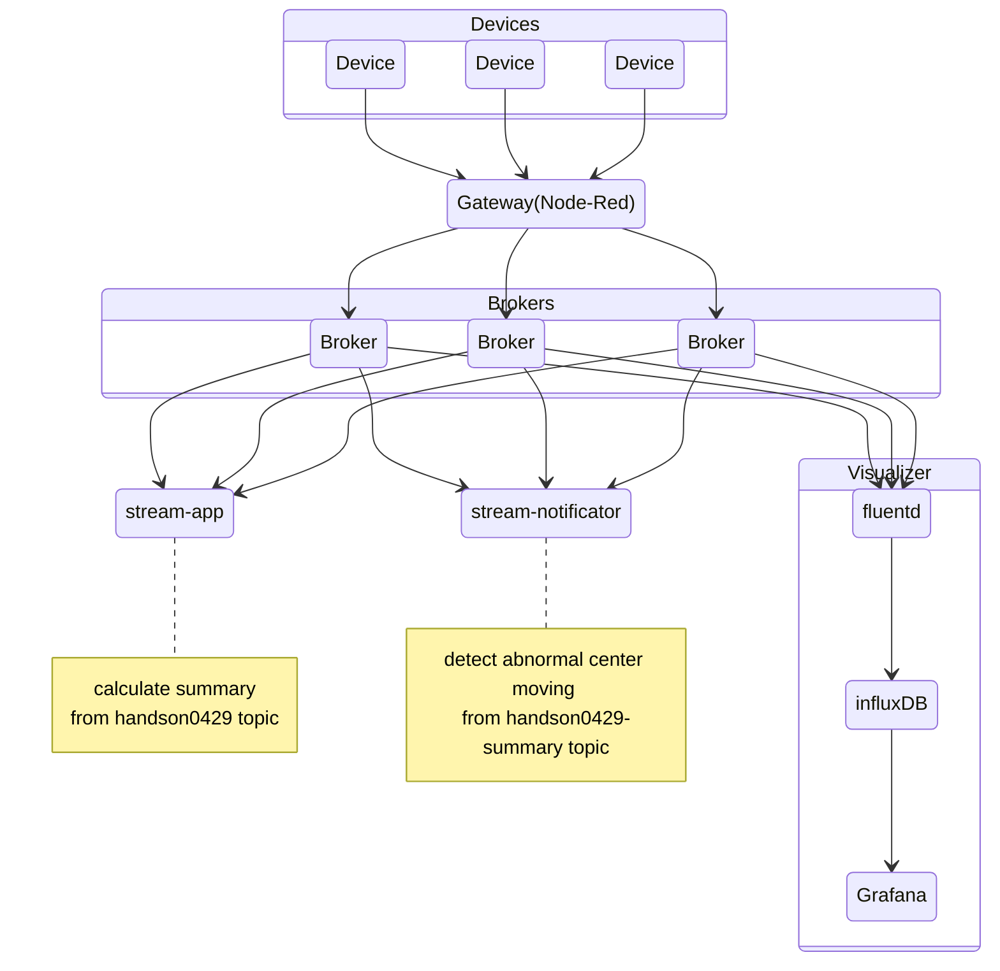

# outline

IoT system using ESP32 handson server side resources.

```mermaid
stateDiagram-v2

state Devices {
  d1: Device
  d2: Device
  d3: Device
}
gw: Gateway(Node-Red)

state Kafka Brokers {
  b1: Broker
  b2: Broker
  b3: Broker
}

app1: stream-app
note right of app1
  calculate summary
  from handson0429 topic
end note

app2: stream-notificator
note right of app2
  detect abnormal center moving 
  from handson0429-summary topic
end note

state Visualizer {
  c1: fluentd
  c2: influxDB
  c3: Grafana
}

d1 --> gw
d2 --> gw
d3 --> gw
gw --> b1
gw --> b2
gw --> b3
b1 --> app1
b2 --> app1
b3 --> app1
b1 --> app2
b2 --> app2
b3 --> app2
b1 --> c1
b2 --> c1
b3 --> c1
c1 --> c2
c2 --> c3
```

